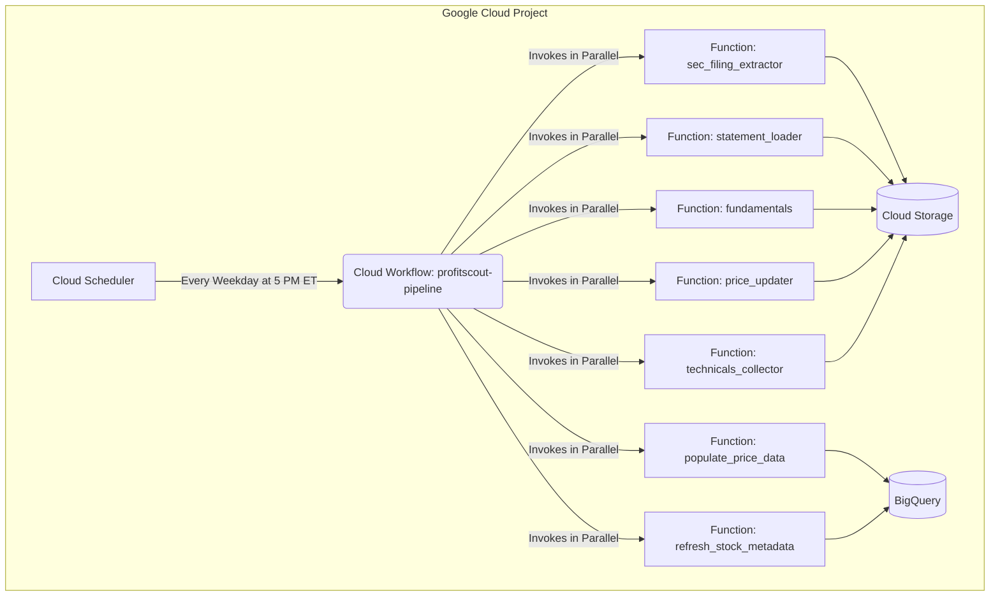
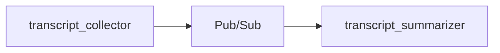

# ProfitScout Financial Data Pipeline


## 1. Project Overview

The ProfitScout Data Pipeline is a fully automated, serverless system built on Google Cloud Platform. Its mission is to collect, process, and analyze a wide array of financial data from public filings, market data providers, and earnings call transcripts. It leverages an orchestrated set of microservices to deliver analysis-ready data to cloud storage, including AI-powered summaries, providing a robust foundation for financial applications and predictive modeling.

## 2. Core Features

* **Automated SEC Filing Extraction**: Intelligently extracts the Business, Risk Factors, and MD&A sections from the latest annual and quarterly company filings.
* **Comprehensive Financial Data Collection**: Fetches and stores the last 8 quarters of financial statements and fundamentals (key metrics, ratios).
* **Daily Market Data Updates**: Collects a 90-day snapshot of historical price data and a suite of technical indicators (SMA, EMA, RSI, etc.).
* **Bulk Historical Price Loading**: Populates BigQuery with full price history for all tracked tickers.
* **AI-Powered Summarization**: Automates the fetching of earnings call transcripts and uses Google's Gemini API to generate structured, insightful summaries focused on financial signals.
* **Declarative & Parallel Orchestration**: Utilizes Cloud Workflows to manage the entire pipeline, running independent data collection tasks in parallel for maximum efficiency.
* **Fully Automated & Scheduled**: Triggered automatically by Cloud Scheduler for timely and consistent data freshness without manual intervention.

## 3. Live Architecture

The entire pipeline is orchestrated by Cloud Workflows, which ensures tasks are run in the correct order and in parallel where possible. All services are serverless, meaning they scale on demand and require no infrastructure management.




## 4. Technology Stack

* **Cloud Provider**: Google Cloud Platform (GCP)
* **Compute**: Cloud Functions (Gen 2, Python 3.12 Runtime)
* **Orchestration**: Cloud Workflows
* **Scheduling**: Cloud Scheduler
* **Storage**: Cloud Storage
* **Data Warehouse**: BigQuery
* **Messaging**: Pub/Sub
* **Security**: Secret Manager
* **Language**: Python
* **Key Libraries**: `google-cloud-storage`, `requests`, `tenacity`, `google-genai`
* **Data Source APIs**: Financial Modeling Prep (FMP), SEC EDGAR (via `sec-api.io`)
* **AI Model**: Google Gemini 2.0 Flash

## 5. Key Design & Engineering Decisions

This project was built with professional-grade engineering practices in mind. The following are key architectural decisions made to ensure the pipeline is efficient, maintainable, secure, and scalable.

* **Serverless Microservices Architecture**: We chose Cloud Functions to break down the complex data pipeline into small, independent, and single-purpose services. This serverless approach allows each component to scale independently, simplifies debugging, and eliminates the need for managing servers, reducing operational overhead.

* **Standardized Application Pattern**: We established a consistent `core`/`orchestrator` structure for every service. This pattern separates concerns, with `client.py` handling external API communication, `gcs.py` managing cloud storage interactions, `config.py` centralizing settings, and `orchestrator.py` containing the core business logic. This standardization makes the codebase highly maintainable and easy for new developers to understand.

* **Efficient API Usage (The "Hybrid Model")**: For services fetching time-series data (like financial statements and transcripts), we implemented a "hybrid" fetching model. Instead of wastefully re-downloading all data daily, the pipeline first makes a single, cheap API call to get the latest available date. It then checks if a file corresponding to that date already exists in Cloud Storage. The expensive, full data download is only triggered if the latest version is not already present, dramatically reducing API calls and costs.

* **Intelligent Service Consolidation**: We made a strategic decision to consolidate the three SEC services into a single, efficient `sec_filing_extractor`. This service intelligently fetches a filing *once* and extracts all three required sections, cutting API calls for this task by ~67%.

* **Declarative Orchestration with Cloud Workflows**: Instead of chaining functions together with brittle event-driven triggers, we used a declarative `workflow.yaml` file. This centralizes the entire pipeline's logic, making it easy to visualize, manage, and modify. It also provides robust error handling and allows for powerful parallel execution, significantly speeding up the total runtime.

* **Event-Driven Transcript Processing**: Transcript collection now publishes a message to Pub/Sub after each upload. The summarization service is triggered by these events, decoupling the two functions and improving fault tolerance.

* **Secure by Design**: All sensitive API keys are stored securely in Google Secret Manager. The Cloud Functions are granted permission to access these secrets at runtime. This practice prevents secrets from ever being exposed in source code or environment variables, adhering to security best practices.

## 6. Service Breakdown

| Service Name | Entry Point | Trigger | Description |
| :--- | :--- | :--- | :--- |
| **`sec_filing_extractor`** | `extract_sec_filings` | HTTP | Extracts Business, MD&A, and Risk Factors from the latest SEC filings. |
| **`fundamentals`** | `refresh_fundamentals`| HTTP | Fetches and stores 8 quarters of financial fundamentals and ratios. |
| **`price_updater`** | `update_prices`| HTTP | Fetches a 90-day snapshot of historical price data. |
| **`statement_loader`** | `load_statements` | HTTP | Retrieves and stores 8 quarters of income, balance sheet, and cash flow statements. |
| **`populate_price_data`** | `populate_price_data` | HTTP | Loads historical price data for tracked tickers into BigQuery. |
| **`technicals_collector`** | `refresh_technicals` | HTTP | Collects a suite of daily technical indicators (SMA, EMA, RSI, etc.). |
| **`refresh_stock_metadata`** | `refresh_stock_metadata` | HTTP | Builds a BigQuery table of earnings call dates and publishes a completion event. |
| **`transcript_collector`**| `refresh_transcripts`| Pub/Sub | Fetches the latest quarterly earnings call transcript and publishes a message with its location. |
| **`transcript_summarizer`**| `create_transcript_summaries` | Pub/Sub | Generates an AI-powered summary for each new transcript message. |

## 7. Setup and Deployment

1.  **Prerequisites**: Google Cloud SDK (`gcloud`) installed and configured with a GCP project.
2.  **Clone Repository**: `git clone [your-repo-url]`
3.  **Secrets**: Ensure API keys for FMP, SEC-API, and Gemini are created and stored in Google Secret Manager.
4.  **Deploy a Service**:
    ```bash
    # Navigate into a service directory, e.g., price_updater
    cd price_updater
    # Deploy the function (example)
    gcloud functions deploy price_updater --gen2 --runtime python312 ...
    ```
5.  **Deploy the Workflow**:
    ```bash
    # From the project root
    gcloud workflows deploy profitscout-pipeline --source=workflow.yaml
    ```

## 8. How to Run the Pipeline

* **Automated Execution**: The pipeline is configured via Cloud Scheduler to run automatically every weekday at 5:00 AM Eastern Time.
* **Manual Execution**: The pipeline can be triggered at any time by running the following `gcloud` command:
    ```bash
    gcloud workflows run profitscout-pipeline
    ```

