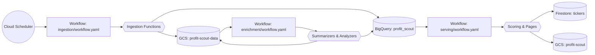
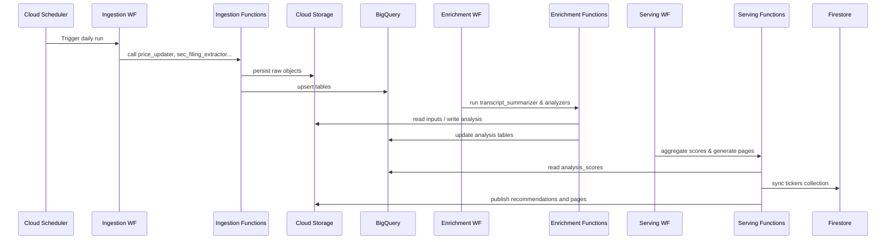

# ProfitScout-Engine — Serverless Financial Data Pipeline

ProfitScout-Engine turns raw market data into actionable investment signals. It ingests public filings and prices, enriches them with AI, and serves ranked scores and pages for downstream apps.

## Key features

- **Broad ingestion**: Cloud Functions pull SEC filings, fundamentals, prices, and technical indicators into Google Cloud Storage and BigQuery.
- **AI enrichment**: Vertex AI summarizers and analyzers transform raw data into structured insights.
- **Automated serving**: Score aggregation, recommendation generation, and site content are produced and synced to Firestore.
- **Workflow-first**: Cloud Workflows coordinate each stage and run on a Cloud Scheduler trigger for fully serverless operation.

## How it works

On a schedule, a workflow fan-outs to ingestion jobs that collect raw data from external APIs and persist to Cloud Storage and BigQuery. A second workflow calls summarization and analysis functions that read that data, invoke Vertex AI, and write enriched artifacts. A final workflow aggregates scores, builds recommendation pages, and pushes data to Firestore for consumption.



## Data flow details



## Repo structure

```
.
├── ingestion/
│   ├── core/
│   └── workflow.yaml
├── enrichment/
│   ├── core/
│   └── workflow.yaml
├── serving/
│   ├── core/
│   └── workflow.yaml
├── fetch_images.py
└── reanme_recs.py
```

- `ingestion/` — collects filings, fundamentals, prices, and metadata.
- `enrichment/` — summarizers and analyzers powered by Vertex AI.
- `serving/` — aggregates scores and publishes recommendations.
- `fetch_images.py` — utility to pull logos for assets.
- `reanme_recs.py` — helper script for renaming recommendation files.

## Quickstart

1. **Prereqs**: Python 3.12, `gcloud` CLI, access to a Google Cloud project.
2. **Setup**
   ```bash
   python -m venv .venv && source .venv/bin/activate
   pip install -r ingestion/requirements.txt
   pip install -r enrichment/requirements.txt
   pip install -r serving/requirements.txt
   ```
3. **Run a sample pipeline**
   ```bash
   python -m ingestion.core.pipelines.price_updater
   ```
4. **View outputs**: processed files appear in `gs://profit-scout-data` and tables in the `profit_scout` dataset.

## Configuration

| Variable | Default | Description | Location |
| --- | --- | --- | --- |
| `PROJECT_ID` | `profitscout-lx6bb` | Source Google Cloud project | `ingestion/core/config.py` |
| `GCS_BUCKET_NAME` | `profit-scout-data` | Raw data bucket | `ingestion/core/config.py` |
| `BIGQUERY_DATASET` | `profit_scout` | Dataset for ingestion outputs | `ingestion/core/config.py` |
| `FMP_API_KEY_SECRET` | `FMP_API_KEY` | Secret name for FMP API key | `ingestion/core/config.py` |
| `SEC_API_KEY_SECRET` | `SEC_API_KEY` | Secret name for SEC API key | `ingestion/core/config.py` |
| `MODEL_NAME` | `gemini-2.0-flash` | Vertex model for summaries | `enrichment/core/config.py` |
| `DESTINATION_PROJECT_ID` | `profitscout-fida8` | Target project for serving assets | `serving/core/config.py` |
| `DESTINATION_GCS_BUCKET_NAME` | `profit-scout` | Bucket for public artifacts | `serving/core/config.py` |
| `FIRESTORE_COLLECTION` | `tickers` | Firestore collection synced by serving workflow | `serving/core/config.py` |

## Pipelines & jobs

- **Ingestion workflow** (`ingestion/workflow.yaml`)
  - **Trigger**: Cloud Scheduler → Cloud Workflow
  - **Inputs**: FMP & SEC APIs
  - **Outputs**: raw files in `gs://profit-scout-data`, tables in `profit_scout`
  - **Logs**: Cloud Logging
- **Enrichment workflow** (`enrichment/workflow.yaml`)
  - **Trigger**: manual or downstream from ingestion completion
  - **Inputs**: previously ingested artifacts
  - **Outputs**: AI summaries and analysis in Cloud Storage and BigQuery
  - **Logs**: Cloud Logging
- **Serving workflow** (`serving/workflow.yaml`)
  - **Trigger**: manual or scheduled
  - **Inputs**: analysis tables and GCS artifacts
  - **Outputs**: `analysis_scores`, recommendations, pages, Firestore docs
  - **Logs**: Cloud Logging

## Observability & artifacts

- **Metrics & tables**: BigQuery dataset `profit_scout` (e.g., `analysis_scores`).
- **Logs**: Cloud Logging for each Cloud Function and workflow step.
- **Artifacts**: raw and enriched files in `gs://profit-scout-data`; published pages and recommendations in `gs://profit-scout`.

## Contributing

1. Create a feature branch off `main`.
2. Format code with `black` and run `pytest` before committing.
3. Submit a pull request describing the change and referencing any related issues.

## License & contact

This repository currently has no explicit open-source license. For questions or partnership inquiries, please open an issue in this repo.

