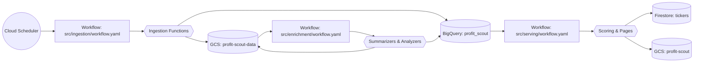

# ProfitScout — Serverless Financial Data Platform

ProfitScout is an end-to-end AI platform for financial analysis, turning raw market data into actionable investment signals for the Russell 1000. It ingests public filings and prices, enriches them with AI, and serves ranked scores and pages for downstream apps.

## Key Features

- **Broad Ingestion**: Cloud Functions pull SEC filings, fundamentals, prices, and technical indicators into Google Cloud Storage and BigQuery.
- **AI Enrichment**: Vertex AI summarizers and analyzers transform raw data into structured insights.
- **Automated Serving**: Score aggregation, recommendation generation, and site content are produced and synced to Firestore.
- **Workflow-First**: Cloud Workflows coordinate each stage and run on a Cloud Scheduler trigger for fully serverless operation.

## How It Works

On a schedule, a workflow fan-outs to ingestion jobs that collect raw data from external APIs and persist to Cloud Storage and BigQuery. A second workflow calls summarization and analysis functions that read that data, invoke Vertex AI, and write enriched artifacts. A final workflow aggregates scores, builds recommendation pages, and pushes data to Firestore for consumption.



## Repository Structure

The repository is organized into a `src` directory containing all application code and a `tests` directory for unit tests.

```
.
├── .github/
│   └── workflows/
│       └── ci.yml
├── src/
│   ├── ingestion/
│   ├── enrichment/
│   ├── serving/
│   ├── options/
│   └── utils/
├── tests/
│   ├── ingestion/
│   └── enrichment/
├── .gitignore
└── README.md
```

- **`src/ingestion/`**: Cloud Functions and pipelines for collecting raw data.
- **`src/enrichment/`**: AI-powered summarizers and analyzers.
- **`src/serving/`**: (Placeholder) Aggregates scores and publishes recommendations.
- **`src/options/`**: (Placeholder) Code for the options-related features.
- **`src/utils/`**: Helper scripts for deployment and data management.
- **`tests/`**: Unit tests for all application code.

## Quickstart

### Prerequisites
- Python 3.12+
- `gcloud` CLI, authenticated to a Google Cloud project.
- An environment variable `FMP_API_KEY` set with your Financial Modeling Prep API key.

### Setup
1.  **Create a virtual environment:**
    ```bash
    python -m venv .venv
    source .venv/bin/activate
    ```

2.  **Install all dependencies:**
    ```bash
    pip install -r src/ingestion/requirements.txt
    pip install -r src/enrichment/requirements.txt
    # Add other requirements files as they become available
    ```

### Running Tests
To run the full suite of unit tests, use `pytest`:
```bash
pytest
```

## Configuration

Configuration for each component is managed within its respective `config.py` file.

| Variable                  | Default             | Description                               | Location                            |
| ------------------------- | ------------------- | ----------------------------------------- | ----------------------------------- |
| `PROJECT_ID`              | `profitscout-lx6bb` | Source Google Cloud project               | `src/ingestion/core/config.py`      |
| `GCS_BUCKET_NAME`         | `profit-scout-data` | Raw data bucket                           | `src/ingestion/core/config.py`      |
| `BIGQUERY_DATASET`        | `profit_scout`      | Dataset for ingestion outputs             | `src/ingestion/core/config.py`      |
| `FMP_API_KEY_SECRET`      | `FMP_API_KEY`       | Secret name for FMP API key               | `src/ingestion/core/config.py`      |
| `SEC_API_KEY_SECRET`      | `SEC_API_KEY`       | Secret name for SEC API key               | `src/ingestion/core/config.py`      |
| `MODEL_NAME`              | `gemini-2.0-flash`  | Vertex model for summaries                | `src/enrichment/core/config.py`     |
| `DESTINATION_PROJECT_ID`  | `profitscout-fida8` | Target project for serving assets         | `src/serving/core/config.py`        |
| `DESTINATION_GCS_BUCKET`  | `profit-scout`      | Bucket for public artifacts               | `src/serving/core/config.py`        |
| `FIRESTORE_COLLECTION`    | `tickers`           | Firestore collection for serving          | `src/serving/core/config.py`        |

## CI/CD
This repository uses GitHub Actions for continuous integration. The workflow, defined in `.github/workflows/ci.yml`, runs automatically on every push and pull request to:
1.  Install all dependencies.
2.  Run the `black` formatter to check for code style.
3.  Execute the `pytest` suite to ensure code quality and correctness.

## Contributing

1.  Create a feature branch off `main`.
2.  Make your changes and ensure they are well-documented.
3.  Format your code with `black .` and run tests with `pytest` before committing.
4.  Submit a pull request describing the change and referencing any related issues.

## License

This project is licensed under the MIT License. See the `LICENSE` file for details.